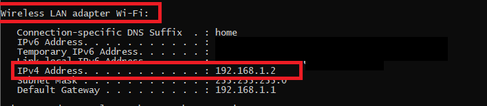

# Connecting Backend With Front end

- Front: Reactjs
- Mobile: React-Nativejs
- Request: fetch
- Server: Nodejs

# Note

While running the Mobile app, localhost/1000 won't point on your pc's localhost (i.e. your server) but instead your emulator / mobile's localhost, so in order to run this, you'll need to create a network:

- Open hotspot from laptop and connect mobile
- Open cmd and type ```ipconfig```
- Place the value of ipconfig inside the fetch function instead of localhost

